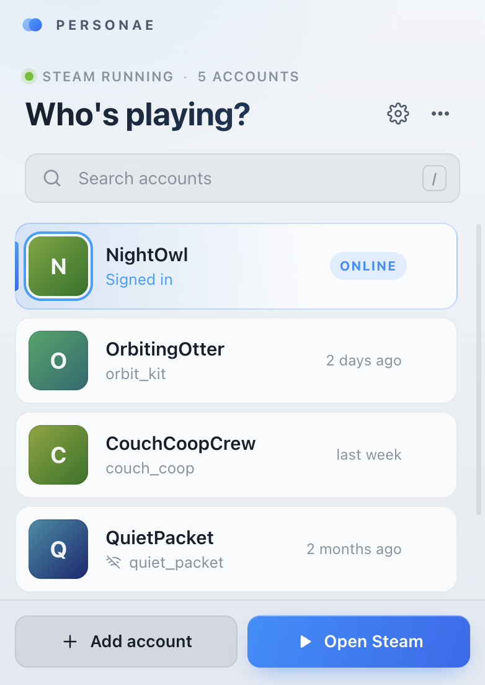
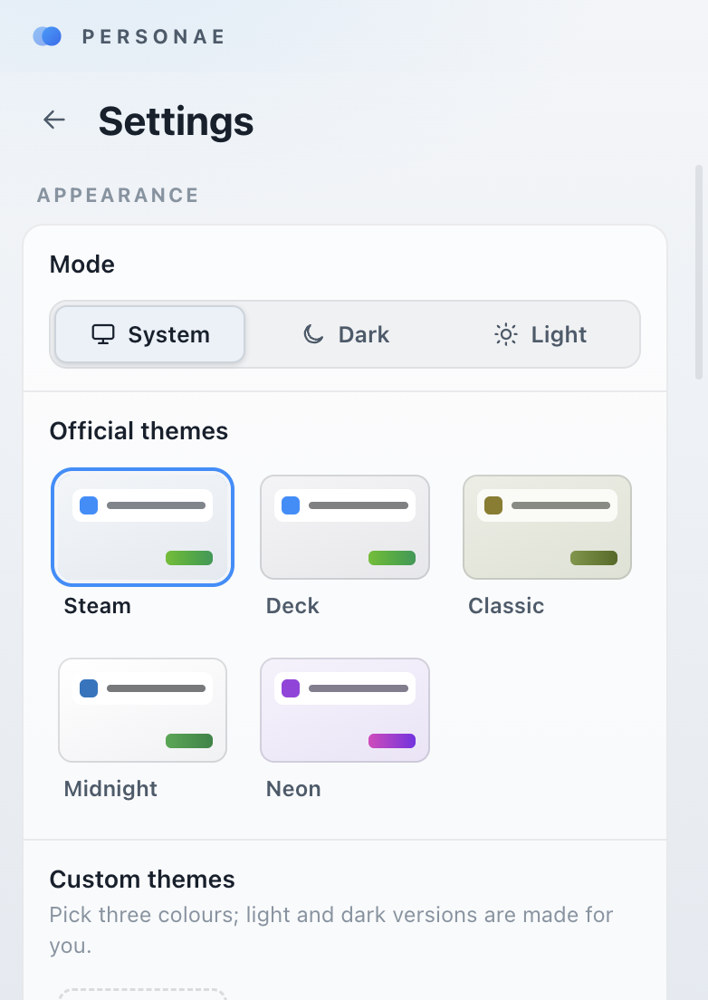

# Personae

**A lightweight Steam account switcher for Windows.** Browse your saved Steam accounts, choose one, and let Personae restart Steam into that account—without manually editing configuration files or signing out and back in each time.

Personae is an independent community project and is not affiliated with Valve or Steam.

## Screenshots

<table>
	<tr>
		<td></td>
		<td></td>
	</tr>
</table>

## What it does

- **Switches between remembered Steam accounts.** Personae finds accounts saved by Steam and starts Steam with the account you choose. Account switching only works without a password prompt when Steam still has a valid remembered login.
- **Adds accounts.** Open Steam's sign-in screen from Personae, sign in with **Remember me**, and the account will appear in the list.
- **Keeps account controls close at hand.** Search and keyboard shortcuts make the list quick to use; the tray menu also provides account switching, add-account, and Steam launch actions.
- **Fits your setup.** Choose light, dark, or system mode; use one of five built-in themes or create a custom palette; hide login names, compact the list, and control what happens after switching or closing the window.
- **Stays out of the way.** Keep Personae in the system tray and optionally start it with Windows (packaged app only).
- **Warns before a switch closes a running game.** When enabled, Personae checks Steam's running-game status before switching.
- **Updates itself in the background.** Installer, MSI and portable builds all download new releases and install them while Personae isn't in use, with a link to each release's notes.

## Getting started

Download the latest **Personae-Setup** installer from [GitHub Releases](https://github.com/fbarker92/personae/releases). The installer is per-user and does not require administrator access. MSI and portable builds are also available for each release.

After installation, open Personae and select a saved account. To add another account, choose **Add account**, sign in to Steam, and tick **Remember me**. Personae uses Steam's locally remembered sign-ins; it does not bypass Steam authentication or recover account passwords.

The application is currently distributed unsigned, so Windows SmartScreen may show a warning on first launch.

## Using Personae

Click an account to switch. Personae asks Steam to close, updates Steam's selected remembered account, and starts Steam again. If Steam requests a password, complete the sign-in in Steam and select **Remember me** for future switches. A backup is kept when Personae updates Steam's `loginusers.vdf` file.

The tray icon opens the app with a left-click. Right-click it for quick account switching, **Add account**, **Launch/Open Steam**, and **Quit**. Closing the main window keeps Personae in the tray by default; this can be changed in Settings.

### Keyboard shortcuts

| Shortcut | Action |
| --- | --- |
| `↑` / `↓`, then `Enter` | Select and switch accounts |
| `1`–`9` | Switch to an account by position |
| `/` or `Ctrl+F` | Search accounts |
| `Ctrl+N` | Add an account |
| `Ctrl+,` | Open Settings |
| `F5` | Refresh the account list |
| Right-click an account | Open profile, copy SteamID, or hide account |

## Settings

Open Settings with the gear button, `Ctrl+,`, or the tray menu. Settings include:

- **Appearance:** System, dark, or light mode; Steam, Deck, Classic, Midnight, and Neon themes; custom themes; compact account rows; and an option to hide login names.
- **Switching:** Stay open, minimise, or hide to tray after switching; warn when a game is running; and pass launch options to Steam (for example, `-silent`).
- **Window and tray:** Choose whether closing the window hides or quits the app; packaged builds can start with Windows, optionally hidden in the tray.
- **Updates and data:** Check for updates, open release notes, choose how new versions are handled (**Automatic**, **Ask first** or **Check only**), clear cached avatars, or reset settings. Reset keeps custom themes and hidden accounts.

## Build from source

Personae uses Electron and electron-builder. To run the app in development:

```bash
npm install
npm start
```

To build Windows packages locally:

```bash
npm run dist
```

The packages are written to `dist/`:

| Package | Purpose |
| --- | --- |
| `Personae-Setup-<version>.exe` | Per-user installer with folder selection |
| `Personae-<version>.msi` | Per-machine installer; requires administrator rights |
| `Personae-<version>-portable.exe` | Portable executable; no installation |

Use `npm run dist:setup`, `npm run dist:msi`, or `npm run dist:portable` to build only one package.

## Releases

To cut a release, bump `version` in `package.json` and merge to `main`. The [Release GitHub Actions workflow](.github/workflows/release.yml) runs on every push to `main`. If there is no `v<version>` tag yet, it builds the Windows packages and publishes a GitHub Release, which also creates the tag. Pushes that don't change the version are skipped. The workflow uses GitHub's automatically provided token.

The app checks public releases from the repository configured in `package.json`. For a fork, point that field to the fork's public repository if you want its builds to use their own update channel.

### How updates install

Personae checks shortly after starting and every 4 hours. In **Automatic** mode it downloads in the background and installs once it's idle: no switch in progress, the window hidden, minimised or unfocused for 2 minutes, and no Steam game running. Then it relaunches the way it was, hidden or showing, and offers **What's new** for the release.

| Build | How the update is applied |
| --- | --- |
| Setup `.exe` | electron-updater downloads (differentially) and runs the installer silently. It only asks for admin if Personae was installed somewhere that needs it |
| `.msi` | Downloads the new `.msi`, checks its SHA-256 against the release, and runs `msiexec /passive` after Personae exits. Windows asks for admin because the MSI installs for all users |
| Portable | Downloads the new portable `.exe`, checks it, and swaps it in once the portable launcher releases the old file. It only asks for admin if the folder is protected |

If an install doesn't take, for example because the admin prompt was declined, Personae says so after relaunching and won't retry that version by itself. **Install now** in Settings → Updates still works. MSI and portable installs log to `%TEMP%\personae-update\install-update.log`.

## Preview the UI

Run `npm run preview` and open [http://localhost:5173](http://localhost:5173) to explore the interface with fictional demo accounts. The preview runs in a browser without connecting to Steam. Add `?game` to simulate a running game, or `?update=available`, `?update=downloading`, `?update=ready`, `?update=installing`, `?update=current`, or `?update=error` to preview update states. Combine with `&mode=auto|ask|manual` and `&kind=installer|msi|portable`, or add `?updated` to see the message shown after an update.

To run a second copy alongside an installed one, set `PERSONAE_USER_DATA` to a separate folder; it gets its own settings and its own single-instance lock.
